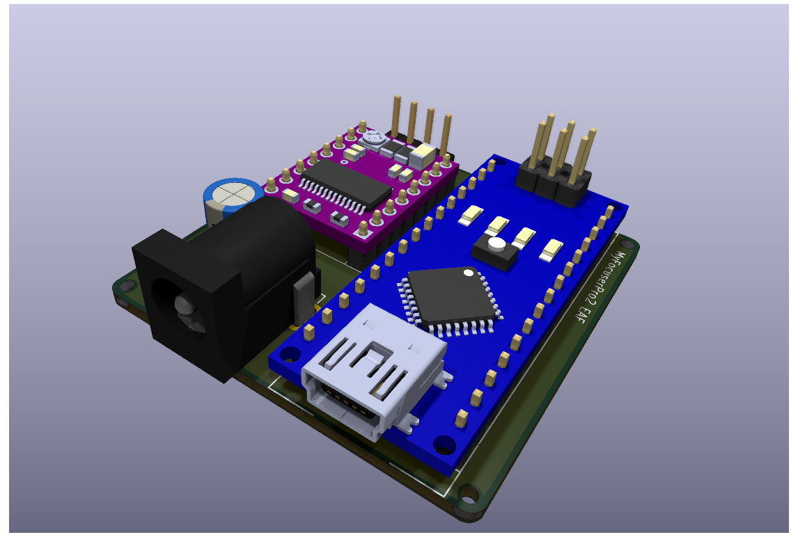

# MyFocuserPro2 EAF - ZWO EAF Compatible Telescope Focuser

A DIY electronic telescope focuser engineered for **heavy imaging trains** and designed to be physically compatible with ZWO EAF (Electronic Automatic Focuser) mounting brackets. Simply order the PCB from JLCPCB or PCBWay, solder a few components, 3D print the enclosure, and you'll have a robust focuser capable of handling substantial camera and filter wheel setups at a fraction of commercial prices.



  

## 🎯 Project Overview

This focuser is based on the MyFocuserPro2 project with modifications for ZWO EAF compatibility. It uses a precision geared stepper motor, Arduino Nano microcontroller, and DRV8825 stepper driver, all integrated into a single compact enclosure that mounts directly to standard ZWO EAF brackets.

**Perfect for astrophotographers** running heavy imaging setups with large cameras, filter wheels, and guide cameras - this focuser provides the torque and precision needed for reliable focusing under load.

### Key Features

- **Heavy Load Capable**: Engineered to handle substantial imaging trains with confidence
- **ZWO EAF Compatible**: Direct physical compatibility with ZWO EAF mounting brackets
- **Simple DIY Build**: Order PCB → Solder components → Print enclosure → Done!
- **High Precision**: Uses 17hs13-0404S-PG27 geared stepper motor from StepperOnline
- **Arduino-Based**: Easy to program and modify with Arduino Nano
- **Cost-Effective**: ~$50-80 total cost vs $300+ for commercial alternatives
- **Production Ready**: Designed for easy ordering from JLCPCB/PCBWay

## 🛠️ Hardware Components

### Main Components

| Component | Part Number/Description | Quantity | Notes |
|-----------|------------------------|----------|-------|
| **Stepper Motor** | 17hs13-0404S-PG27 | 1 | Geared stepper from StepperOnline |
| **Microcontroller** | Arduino Nano | 1 | Standard Arduino Nano board |
| **Motor Driver** | DRV8825 | 1 | Pololu-compatible stepper driver |
| **Capacitor** | 100µF Electrolytic | 1 | Power supply filtering |
| **Power Connector** | DC Barrel Jack | 1 | 12V power input |
| **Motor Connector** | 4-pin Header | 1 | Stepper motor connection |


### PCB Specifications

- **Design Tool**: KiCad 9.x
- **Board Size**: Compact form factor optimized for enclosure
- **Layers**: 2-layer PCB design
- **Manufacturing**: Optimized for JLCPCB and PCBWay production
- **Power**: 12V input
- **Assembly**: Only 6 components to solder by hand

## 📁 Repository Structure

```
├── README.md                           # This file
├── enclosure/                          # 3D Printable Parts
│   ├── eaf-body.stl                   # Main enclosure body
│   └── eaf-cover.stl                  # Enclosure cover/lid
├── myfocuserpro2-eaf/                  # KiCad Project Files
│   ├── myfocuserpro2-eaf.kicad_pro    # KiCad project file
│   ├── myfocuserpro2-eaf.kicad_sch    # Schematic design
│   ├── myfocuserpro2-eaf.kicad_pcb    # PCB layout
│   ├── models/                        # 3D Models for PCB
│   │   ├── Arduino Nano.STEP          # Arduino Nano 3D model
│   │   └── DRV8825 STEPPER MOTOR...   # DRV8825 3D model
│   └── production/                    # Manufacturing Files
│       ├── bom.csv                    # Bill of Materials
│       ├── positions.csv              # Component placement
│       ├── designators.csv            # Component designators
│       ├── netlist.ipc                # Netlist for assembly
│       └── myfocuserpro2-eaf.zip     # Gerber files
```

## 🔧 Assembly Instructions

### 1. Order PCB

**JLCPCB Ordering:**
1. Go to [JLCPCB.com](https://jlcpcb.com)
2. Upload the Gerber file: `myfocuserpro2-eaf/production/myfocuserpro2-eaf.zip`
3. Use default settings (2-layer, 1.6mm thickness)
4. Order quantity: 5 boards (minimum order)
5. Cost: ~$10-15 shipped

**PCBWay Ordering:**
1. Go to [PCBWay.com](https://pcbway.com)
2. Upload the same Gerber file
3. Use default settings
4. Order quantity: 5 boards (minimum order)
5. Cost: ~$15-20 shipped

### 2. Source Components

**Total component cost: ~$30-40**

Order these components (reference `production/bom.csv` for exact specifications):
- Arduino Nano (1x) - ~$8
- DRV8825 driver board (1x) - ~$5
- 100µF electrolytic capacitor (1x) - ~$1
- DC barrel jack connector (1x) - ~$2
- Pin headers 2.54mm pitch (1x set) - ~$3
- 17hs13-0404S-PG27 stepper motor - ~$25

### 3. PCB Assembly (15 minutes)

**Required tools:** Soldering iron, solder, flux (optional)

1. **Solder Arduino Nano**: Place and solder to A1 position
2. **Solder DRV8825**: Place and solder to A2 position  
3. **Solder Capacitor**: Install C1 (mind polarity - longer leg to +)
4. **Solder Connectors**: Install J1 (4-pin), J2 (barrel jack), J3 (3-pin)
5. **Clean and inspect**: Check for cold joints and bridges

*No SMD components - all through-hole for easy hand soldering!*

### 4. 3D Printing (2-3 hours print time)

Print the enclosure parts from the `enclosure/` directory:

- **Files**: `eaf-body.stl` and `eaf-cover.stl`
- **Material**: PETG
- **Layer Height**: 0.2mm
- **Infill**: 20-30%
- **Print Speed**: Standard settings
- **Supports**: Minimal or none required
- **Cost**: ~$3-5 in filament

### 5. Motor Selection - Built for Heavy Loads

**Recommended Motor**: 17hs13-0404S-PG27 from StepperOnline

**Why this motor handles heavy imaging trains:**
- **27:1 Planetary Gearbox**: Massive torque multiplication for heavy loads
- **High Holding Torque**: Maintains position even with substantial weight
- **Smooth Operation**: Planetary gearing reduces vibration and backlash
- **Proven Design**: Successfully used in commercial focusers
- **Direct Mount**: No coupling required - direct attachment to focuser

**Load Capacity**: Easily handles imaging trains exceeding 3kg.

Tested with the following image train with consistent results. ZWO EAF had issues handling this image train.

* Sharpstar ED 1x Coma corrector
* ZWO Off Axis Guider
* Wanderer Astro Rotator Mini V2
* ZWO 7x2" EFW (fully loaded)
* ASI2600MC

### 6. Final Assembly (10 minutes)

1. **Install PCB**: Place assembled PCB into printed enclosure body
2. **Connect Motor**: Stepper motor to J1 (4-pin header)
3. **Connect Power**: 12V power supply to J2 (barrel jack)
5. **Secure Cover**: Attach printed cover and test functionality
6. **Mount to Telescope**: Install using standard ZWO EAF bracket

**Total Build Time**: ~30 minutes active work + print time
**Total Cost**: ~$50 vs $300+ commercial focusers

## ⚡ Power Requirements

- **Input Voltage**: 12V DC
- **Current Draw**: < 500mA 
- **Power Connector**: Standard 2.1mm barrel jack (center positive)

## 🔌 Connections

### Motor Connection (J1)
```
Pin 1: A+    (Motor Phase A)
Pin 2: A-    (Motor Phase A)
Pin 3: B+    (Motor Phase B)
Pin 4: B-    (Motor Phase B)
```

### Control Interface (J3)
```
Pin 1: GND   (Ground)
Pin 2: IN    (Input/Button)
Pin 3: VCC   (3.3V/5V)
```

## 💻 Software

This hardware is designed to work with MyFocuserPro2 firmware or compatible Arduino-based focuser software. The Arduino Nano can be programmed via USB using the Arduino IDE.

**Recommended Software**:
- MyFocuserPro2 firmware
- ASCOM drivers for Windows
- INDI drivers for Linux

## 🔗 Compatibility

### Mechanical Compatibility
- **ZWO EAF Bracket**: Direct mounting compatibility
- **Telescope Interfaces**: Standard focuser mounting patterns
- **Motor Coupling**: 17hs13-0404S-PG27 optimized design

### Software Compatibility
- **ASCOM**: Via MyFocuserPro2 drivers
- **INDI**: Linux astronomy software
- **Custom Software**: Arduino-programmable for custom implementations

## 📋 Bill of Materials (BOM)

| Designator | Component | Value/Part Number | Quantity |
|------------|-----------|-------------------|----------|
| A1 | Arduino Nano | Standard Arduino Nano | 1 |
| A2 | DRV8825 | Stepper Motor Driver | 1 |
| C1 | Electrolytic Capacitor | 100µF | 1 |
| J1 | Pin Header | 4-pin, 2.54mm | 1 |
| J2 | Barrel Jack | DC Power Jack | 1 |

*Complete BOM with part numbers available in `myfocuserpro2-eaf/production/bom.csv`*

## 📐 Mechanical Specifications

- **Load Capacity**: 3-5kg+ imaging trains (6-11+ lbs)
- **Enclosure Dimensions**: Optimized for ZWO EAF bracket compatibility
- **Weight**: Approximately 200-300g (depending on motor)
- **Mounting**: Standard ZWO EAF bracket interface
- **Motor Output**: Direct coupling to focuser mechanism
- **Backlash**: Minimal due to planetary gearbox design
- **Resolution**: Sub-micron focusing steps with geared motor

## 🚀 Getting Started - Quick Build Guide

**Total Cost: ~$50-80 | Build Time: ~30 minutes + 3 hours printing**

1. **Order PCB**: Upload Gerber files to JLCPCB or PCBWay (~$10-15)
2. **Buy Components**: Arduino Nano, DRV8825, motor, and basic parts (~$30-40)
3. **Order Motor**: 17hs13-0404S-PG27 from StepperOnline (~$25)
4. **3D Print**: Print enclosure parts (~$3-5 filament cost)
5. **Assemble**: 15 minutes soldering + 10 minutes final assembly
6. **Install Software**: Load MyFocuserPro2 firmware
7. **Mount and Focus**: Attach to telescope and enjoy precision focusing!

**Perfect for:**
- Heavy imaging setups (large cameras + filter wheels)
- Long focal length telescopes requiring precise focusing
- Astrophotographers wanting reliable, affordable automation
- Anyone tired of manual focusing with heavy equipment

## 🤝 Contributing

This is an open-source project. Contributions are welcome for:
- PCB improvements and optimizations
- Enclosure design enhancements
- Software compatibility updates
- Documentation improvements

## 📄 License

This project is open source. Please check individual file headers and project documentation for specific licensing terms.

## 🛠️ Support

For technical support and questions:
- Check existing issues and documentation
- Review MyFocuserPro2 project documentation
- Consult KiCad files for detailed design information

## 🔗 Related Projects

- **MyFocuserPro2**: Base project this design is derived from
- **ZWO EAF**: Commercial focuser this project is compatible with
- **StepperOnline**: Source for recommended geared stepper motor

---

**Note**: This project requires basic electronics assembly skills and access to PCB manufacturing services. Ensure you have appropriate tools and experience before beginning assembly.
